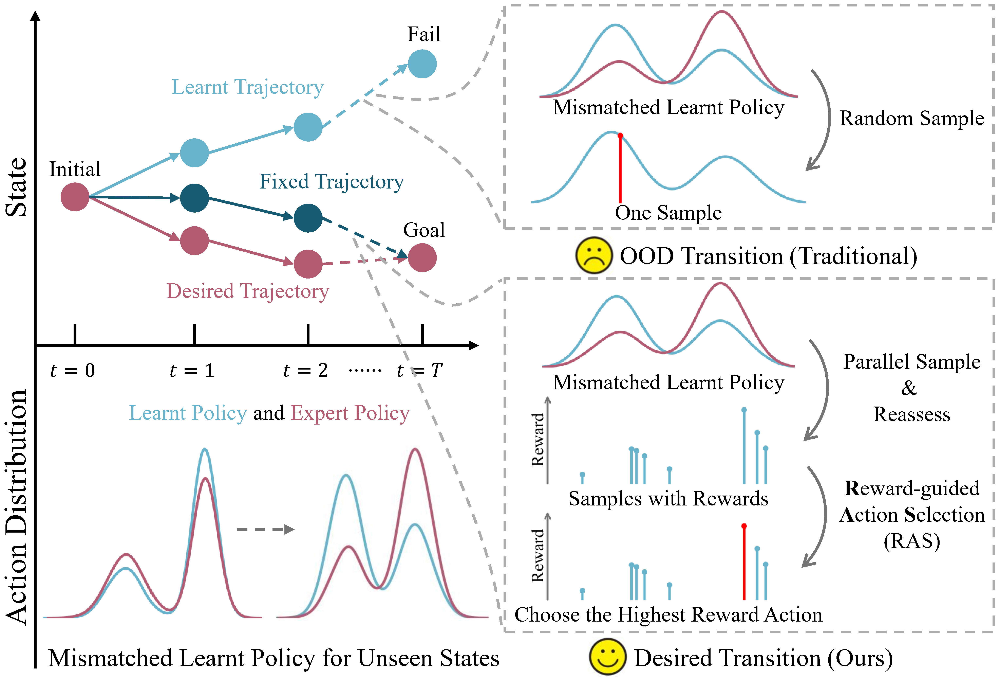
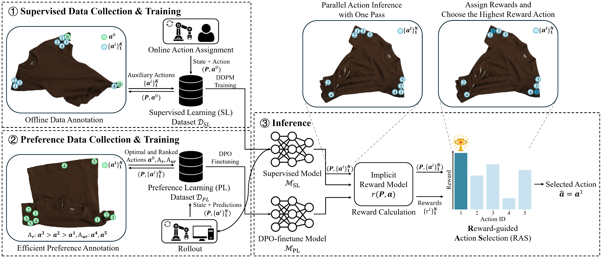

<h3 align="center">
    🦾DeformPAM: Data-Efficient Learning for
    <br>Long-horizon <u>Deform</u>able Object Manipulation via
    <br><u>P</u>reference-based <u>A</u>ction Align<u>m</u>ent
</h3>
<h4 align="center">
    ICRA 2025
</h4>

<p align="center">
    <a href="https://wendichen.me">Wendi Chen</a><sup>1*</sup>,
    <a href="https://hanxue.me">Han Xue</a><sup>1*</sup>,
    Fangyuan Zhou<sup>1</sup>,
    Yuan Fang<sup>1</sup>,
    <a href="https://www.mvig.org/">Cewu Lu</a><sup>1</sup>
    <br>
    <sup>1</sup>Shanghai Jiao Tong University,
    <sup>*</sup> indicates equal contribution
    <br>
</p>

<div align="center">
<a href='https://arxiv.org/abs/2410.11584'></a> &nbsp;&nbsp;&nbsp;&nbsp;
<a href='https://deform-pam.robotflow.ai'></a> &nbsp;&nbsp;&nbsp;&nbsp;
<a href='https://huggingface.co/datasets/WendiChen/DeformPAM_Dataset'></a> &nbsp;&nbsp;&nbsp;&nbsp;
<a href='https://huggingface.co/WendiChen/DeformPAM_PrimitiveDiffusion'></a> &nbsp;&nbsp;&nbsp;&nbsp;
 &nbsp;&nbsp;&nbsp;&nbsp;
</div>

## News
- **2025.01**: DeformPAM is accepted to ICRA 2025! 🎉
- **2024.10**: We release the pretrained models.
- **2024.10**: We release the data.
- **2024.10**: We release the code of DeformPAM.

## Contents

- [📄 Introduction](#-introduction)
  - [Key Idea](#key-idea)
  - [Motivation](#motivation)
  - [Method](#method)
  - [Tasks and Hardware Setup](#tasks-and-hardware-setup)
- [⚙️ Environment Setup](#️-environment-setup)
  - [🧠 Learning Environment](#-learning-environment)
  - [🤖 Real Environment](#-real-environment)
  - [📦 Miscs](#-miscs)
- [📕 Usage](#-usage)
  - [🔍 Inference](#-inference)
  - [📚 Train Your Own Model](#-train-your-own-model)
- [🙏 Acknowledgement](#-acknowledgement)
- [🔗 Citation](#-citation)

## 📄 Introduction

### Key Idea
To quickly grasp the concept of DeformPAM, you may refer to [`predict()`](learning/net/primitive_diffusion.py#L1391) method in [learning.net.primitive_diffusion::PrimitiveDiffusion](learning/net/primitive_diffusion.py).

### Motivation

In long-horizon manipulation tasks, a probabilistic policy may encounter distribution shifts when imperfect policy fitting leads to unseen states. As time progresses, the deviation from the expert policy becomes more significant. Our framework employs Reward-guided Action Selection (RAS) to reassess sampled actions from the generative policy model, thereby improving overall performance.

<p align="center">

</p>

### Method



- In stage ①, we assign actions for execution and annotate auxiliary actions for supervised learning in a real-world environment and train a supervised primitive model based on Diffusion. Circles with the same numbers represent the manipulation positions for an action.
- In stage ②, we deploy this model in the environment to collect preference data composed of annotated and predicted actions. These data are used to train a DPO-finetuned model.
- During stage ③ (inference), we utilize the supervised model to predict actions and employ an implicit reward model derived from two models for Reward-guided Action Selection (RAS). The action with the highest reward is regarded as the final prediction.

### Tasks and Hardware Setup

The following figure illustrates the object states and primitives of each task. Beginning with a random complex state of an object, multiple steps of action primitives are performed to gradually achieve the target state.
<p align="center">

</p>

Here is the hardware setup and tools used in our real-world experiments. Devices and tools marked with DP are not used in primitive-based methods.
<p align="center">

</p>

## ⚙️ Environment Setup

### 🧠 Learning Environment

The learning code should work on environments that meet the following requirements:

- Modern Linux Distributions that are not in EOL.
- Python >= 3.8
- Pytorch >= 1.11.0
- CUDA >= 11.3

We recommend these combinations:

- Ubuntu 20.04
- Python = 3.8
- Pytorch = 1.11.0
- CUDA = 11.3

To setup the learning environment, you need to download and install CUDA from [here](https://developer.nvidia.com/cuda-downloads) in advance. Then, you should run the `setup-env.sh` script to setup all basic requirments except for GroundedSAM.


```bash
bash setup-env.sh
```

This script will automatically create an conda environment named `DeformPAM` and install dependent packages in it. You can modify this script to make it behaves differently.

Finally, see [GroundedSAM](https://github.com/IDEA-Research/Grounded-Segment-Anything) for installation of Grounded-DINO and Segment-Anything.

### 🤖 Real Environment

#### 📷 Camera

Our project should work on any commercial 3D cameras systems that produce colorful point cloud and RGB images. However, for the best performance, we recommend high-precision and high-resolution 3D cameras. In our experiment, we adopt [Photoneo MotionCam3D M+](https://www.photoneo.com/products/motioncam-3d-m-plus/) and [Mech-Mind Mech-Eye LSR L](https://community.mech-mind.com/t/topic/2112) as the main 3D camera. However, if you are using custom cameras, please re-implement `get_obs()` method in [manipulation.experiment_real::ExperimentReal](manipulation/experiment_real.py#L408).

Please generate the calibration files and set the `CALIBRATION_PATH` in [Makefile](Makefile). You can take [tools/handeye_cali.py](handeye_cali.py) and [tools/find_world_transform_from_robot_cali.py](find_world_transform_from_robot_cali.py) for reference.

#### 🦾 Robot

Our experiments are conducted using two [Flexiv Rizon 4](https://www.flexiv.cn/en/product/rizon) robot arms through [Flexiv RDK](https://rdk.flexiv.com/en/). Please re-implement [controller.robot_actuator::RobotActuator](controller/robot_actuator.py#L1), [controller.atom_controller::AtomController](controller/atom_controller.py#L8), and [controller.controller::Controller](controller/controller.py#L6), whether you are using Flexiv or custom robot arms .

### 📦 Miscs

#### 🔧 Tools

Please refer to [tools/data_management/README.md](tools/data_management/README.md) for setting up the data management tools.

## 📕 Usage

### 🔍 Inference

You can modify the [`TASK_TYPE`](Makefile#L3), [`SUPERVISED_MODEL_CKPT_PATH`](Makefile#L46), and [`TEST_MODEL_CKPT_PATH`](Makefile#L47) in [Makefile](Makefile) and run the following command to conduct inference on the real-world environment. The pre-trained models can be downloaded on [](https://huggingface.co/WendiChen/DeformPAM_PrimitiveDiffusion).

```bash
make test_real
```

### 📚 Train Your Own Model

The training pipeline includes 2 stages, all wrapped as Makefile targets. You can download the data on [](https://huggingface.co/datasets/WendiChen/DeformPAM_Dataset) or collect your own data according to the following instructions.

#### Stage 1 (Supervised Learning)

Set up the [`TASK_TYPE`](Makefile#L3) and [`TASK_VERSION`](Makefile#L6) in [Makefile](Makefile) and run the following commands:

```bash
# Stage 1.1: collect supervised data
make supervised.run_real
# Stage 1.2: annotate supervised data
make scripts.run_supervised_annotation
# Stage 1.3: train supervised model
make supervised.train_real
```

#### Stage 2 (Preference Learning)
Set up the [`SUPERVISED_MODEL_CKPT_PATH`](Makefile#L46) in [Makefile](Makefile) to the path of the trained model in stage 1. Then run the following commands:

```bash
# Stage 2.1: collect on-policy data
make finetune.run_real
# Stage 2.2: train preference model
make scripts.run_finetune_sort_annotation
# Stage 2.3: train DPO-finetuned model
make finetune.train_real
```

## 🙏 Acknowledgement

The motion primitives, data annotation tool, and some useful code used in our project are adapted from [UniFolding](https://github.com/xiaoxiaoxh/UniFolding).

## 🔗 Citation
If you find this work helpful, please consider citing:

```bibtex
@article{chen2024deformpam,
  title     = {DeformPAM: Data-Efficient Learning for Long-horizon Deformable Object Manipulation via Preference-based Action Alignment},
  author    = {Chen, Wendi and Xue, Han and Zhou, Fangyuan and Fang, Yuan and Lu, Cewu},
  journal   = {arXiv preprint arXiv:2410.11584},
  year      = {2024}
}
```
